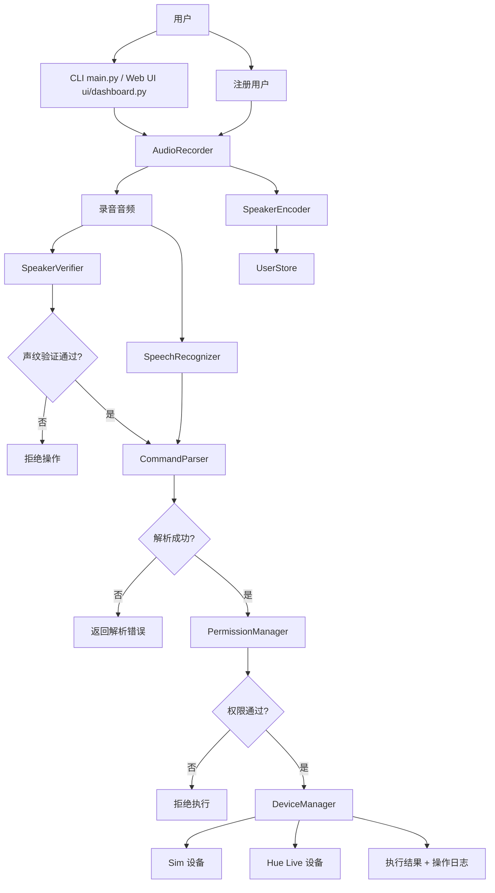

# smart-home-voice-lock

基于语音身份验证的智能家居控制项目。系统先录音，再并行完成声纹验证和语音识别；只有通过身份验证的用户，才能继续执行设备指令。项目同时支持本地模拟设备和 Philips Hue 真实硬件，并提供 CLI 与 Gradio Web 仪表板两种入口。

## 功能列表

- 16 kHz 单声道录音，支持实时 ASCII 音量条和录音质量检查
- 基于 SpeechBrain ECAPA-TDNN 的声纹编码与用户注册
- 基于余弦相似度的声纹验证
- 基于 OpenAI Whisper 的中文语音转写
- 基于正则和关键词匹配的中文家居指令解析
- 基于角色的权限控制：`owner > family/admin > member/resident > guest`
- `sim` 模式：内存内模拟灯光、门锁、空调
- `live` 模式：通过 Hue Bridge 控制真实 Philips Hue 灯具、灯组、场景
- CLI 主循环：录音、验证、识别、解析、执行、审计日志
- Gradio 仪表板：设备面板、语音控制、场景按钮、用户管理、Hue 设置
- 用户数据持久化到 JSON 文件，操作审计写入日志
- 完整的 pytest 测试集

## 架构图



## 安装步骤

### 1. 创建虚拟环境

```bash
cd /path/to/smart-home-voice-lock
python -m venv .venv
source .venv/bin/activate
```

### 2. 安装依赖

如果你仓库里已经有 `requirements.txt`，可以直接：

```bash
pip install -r requirements.txt
```

如果当前工作区还没有 `requirements.txt`，可直接执行：

```bash
pip install sounddevice scipy speechbrain openai-whisper phue2 pyyaml gradio pytest pytest-cov flake8
```

如果你的 Python 版本上 `phue2` 安装失败，代码也支持 `phue` 作为回退：

```bash
pip install phue
```

### 3. 验证安装

```bash
pytest tests -v
```

## 快速开始

### CLI

```bash
python main.py
```

### Web UI

```bash
python ui/dashboard.py
```

## 使用说明

### sim 模式

`sim` 模式不依赖任何真实硬件，适合本地开发和跑测试。

1. 打开 [config.yaml](./config.yaml)
2. 确认 `devices.mode: sim`
3. 运行：

```bash
python main.py
```

4. 首次使用建议先注册用户
5. 注册完成后，按回车开始录音并说出设备指令

### live 模式

`live` 模式会连接 Philips Hue Bridge，并根据 `hue.light_aliases`、`hue.group_aliases`、`hue.scene_aliases` 把真实资源映射到项目内设备 ID。

1. 完成 Hue Bridge 配对
2. 打开 [config.yaml](./config.yaml)
3. 把 `devices.mode` 改成 `live`
4. 检查 `hue.bridge.ip` 和 `hue.bridge.username` 已写入
5. 根据你家里的设备名称调整别名映射
6. 运行：

```bash
python main.py
```

或：

```bash
python ui/dashboard.py
```

## Hue Bridge 配对教程

项目内置了配对脚本 [setup_hue.py](./setup_hue.py)。

### Step 1. 确认网络

- 电脑和 Hue Bridge 在同一个局域网
- Hue Bridge 已通电并联网
- 真实灯具已经在 Hue 官方 App 中可见

### Step 2. 运行配对脚本

```bash
python setup_hue.py
```

如果自动发现失败，也可以手动指定 IP：

```bash
python setup_hue.py --ip 192.168.1.2
```

### Step 3. 等待发现 Bridge

脚本会：

- 调用 `https://discovery.meethue.com/` 发现 Bridge
- 对发现到的 IP 执行 `/api/config` 探测
- 让你选择 Bridge，或手动输入 IP

### Step 4. 按下 Bridge 按钮

脚本提示：

```text
请按下 Hue Bridge 的配对按钮，然后按回车继续...
```

这一步必须在提示后尽快完成。

### Step 5. 获取 username

脚本会向 Bridge 的 `/api` 发起配对请求，成功后写回：

- `hue.bridge.ip`
- `hue.bridge.username`

### Step 6. 自动扫描资源

脚本会继续扫描：

- 所有灯具
- 所有灯组
- 所有场景

### Step 7. 完成提示

配对成功后，脚本会闪烁所有灯一次，作为成功反馈。

### Step 8. 切换到 live 模式

打开 [config.yaml](./config.yaml)，确认：

```yaml
devices:
  mode: live
```

然后启动 CLI 或 Web UI。

## 支持的语音指令

### 1. 基本开关控制

支持前置和后置两种语序。

示例：

- `打开卧室灯`
- `开启客厅灯`
- `关掉客厅所有灯`
- `把书房灯打开`
- `把卧室灯关掉`

支持动词：

- 打开：`打开` `开启` `开`
- 关闭：`关掉` `关闭` `关上` `关`

### 2. 亮度控制

模式：

- `把<设备>调到 50%`
- `把<设备>亮度设置为 50%`

示例：

- `把书房灯调到 50%`
- `把卧室灯亮度设为 80%`

### 3. 色温控制

模式：

- `把<设备>调成 <色温>`
- `把<设备>设置为 <色温>`
- `把<设备>变成 <色温>`

支持色温关键词：

- 中文：`暖光` `暖白` `自然光` `中性光` `冷光` `冷白`
- 英文：`warm` `neutral` `cool`

示例：

- `把卧室灯调成暖光`
- `请把卧室灯设置为 warm`

### 4. 颜色控制

模式：

- `把<设备>调成 <颜色>`
- `把<设备>设置为 <颜色>`
- `把<设备>变成 <颜色>`

支持颜色关键词：

- `red` `红` `红色`
- `orange` `橙` `橙色`
- `yellow` `黄` `黄色`
- `green` `绿` `绿色`
- `cyan` `青` `青色`
- `blue` `蓝` `蓝色`
- `purple` `紫` `紫色`
- `pink` `粉` `粉色`
- `white` `白` `白色`

示例：

- `客厅灯变成蓝色`
- `把卧室灯变成 blue`

### 5. Hue 场景切换

模式：

- `切换到 <场景>`
- `切到 <场景>`
- `启动 <场景>`
- `开启 <场景>`
- `进入 <场景>`

示例：

- `切换到阅读模式`
- `进入阅读场景`

### 6. 快捷指令

当前配置内置：

- `晚安`
- `我回来了`

说明：

- 这类指令目前会被识别并返回快捷指令结果
- 默认不会自动映射到具体设备动作
- 如需执行设备联动，需要后续在业务层继续扩展

### 7. 特殊系统命令

CLI / 主流程支持：

- `注册用户`
- `退出`
- `register`
- `enroll`
- `exit`
- `quit`

## 添加用户教程

### 方法一：CLI 注册

1. 运行：

```bash
python main.py
```

2. 输入：

```text
注册用户
```

3. 按提示输入：

- `user_id`
- 用户姓名
- 角色
- 权限列表

4. 根据提示录制 3 段语音样本
5. 系统会对 3 段样本做质量检查、提取 embedding、求平均并写入 `data/users.json`

### 方法二：Web UI 注册

1. 启动：

```bash
python ui/dashboard.py
```

2. 打开“用户管理”Tab
3. 填写：

- `user_id`
- 姓名
- 角色
- 权限列表

4. 上传或录制 3 段样本
5. 点击“注册新用户”

### 用户数据格式

用户存储在 JSON 中，字段如下：

- `user_id`
- `name`
- `embedding`
- `role`
- `permissions`
- `enrolled_at`

## 故障排除 FAQ

### Q1. 程序启动后一直提示“声纹验证失败”

可能原因：

- 还没有注册任何用户
- 当前说话人与注册样本差异较大
- `verification.threshold` 设置过高

排查：

- 检查 `data/users.json` 是否有用户
- 重新注册用户
- 适当降低 [config.yaml](./config.yaml) 中的 `verification.threshold`

### Q2. 录音时提示音量太低或时长太短

原因：

- 麦克风输入过小
- 距离麦克风太远
- 提前停止录音

排查：

- 调高系统输入音量
- 靠近麦克风
- 调整 `audio.low_volume_threshold` 和 `audio.min_duration`

### Q3. 提示 `openai-whisper` 或 `speechbrain` 未安装

执行：

```bash
pip install openai-whisper speechbrain
```

如果还缺 `torch`，再执行：

```bash
pip install torch
```

### Q4. `sounddevice` 录音失败

可能原因：

- 系统没授予麦克风权限
- 当前环境没有可用输入设备

排查：

- 给 Python / 终端授予麦克风权限
- 在系统设置中确认输入设备可用

### Q5. live 模式下提示 Hue Bridge 不可达

排查：

- 电脑和 Bridge 是否在同一局域网
- `hue.bridge.ip` 是否正确
- Bridge 是否通电
- 路由器是否更换了 IP

可重新执行：

```bash
python setup_hue.py
```

### Q6. live 模式下灯具能连上，但语音识别不到设备

原因：

- 真实灯具名称和配置别名不一致

排查：

- 更新 [config.yaml](./config.yaml) 中的：
  - `hue.light_aliases`
  - `hue.group_aliases`
  - `hue.scene_aliases`

### Q7. Web UI 无法启动，提示缺少 Gradio

执行：

```bash
pip install gradio
```

### Q8. 配对后 `config.yaml` 里的注释消失了

原因：

- `setup_hue.py` 和仪表板 Hue 设置页会通过 PyYAML 重写配置文件
- PyYAML 默认不会保留注释

说明：

- 仓库里的默认 [config.yaml](./config.yaml) 已补充充分注释
- 如果你执行了自动写回，注释可能被清空，这是当前实现的已知行为

## 项目结构说明

```text
smart-home-voice-lock/
├── auth/
│   ├── enrollment.py
│   ├── permission_manager.py
│   └── user_store.py
├── core/
│   ├── audio_recorder.py
│   ├── command_parser.py
│   ├── speaker_encoder.py
│   ├── speaker_verifier.py
│   └── speech_recognizer.py
├── devices/
│   ├── base_device.py
│   ├── device_manager.py
│   ├── hue/
│   │   ├── hue_bridge.py
│   │   ├── hue_discovery.py
│   │   ├── hue_group.py
│   │   ├── hue_light.py
│   │   └── hue_scene.py
│   └── sim/
│       ├── sim_door_lock.py
│       ├── sim_light.py
│       └── sim_thermostat.py
├── ui/
│   └── dashboard.py
├── tests/
├── config.yaml
├── main.py
└── setup_hue.py
```

### 目录职责

- `core/`：录音、ASR、声纹编码、声纹验证、语音指令解析
- `auth/`：用户注册、用户存储、角色权限判断
- `devices/`：设备抽象、模拟设备、Hue 真实设备和统一设备管理
- `ui/`：Gradio 仪表板
- `main.py`：CLI 入口和完整 pipeline 编排
- `setup_hue.py`：Hue Bridge 配对脚本
- `tests/`：pytest 自动化测试

## 开发与测试

运行全部测试：

```bash
pytest tests -v
```

查看覆盖率：

```bash
pytest --cov=core --cov=devices --cov=auth tests
```

## 当前状态

- CLI 主流程可在 `sim` 模式下完整跑通
- Web UI 已接入现有后端模块
- Hue live 模式已完成代码集成和 mock 测试
- 当前仓库中未扫描到 `TODO` 或 `NotImplementedError`
