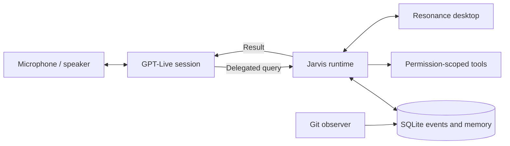

# Jarvis

**A resident AI assistant for macOS, with real-time voice, persistent context, and asynchronous backend queries.**


Jarvis connects a real-time voice session to a Python runtime that owns conversation records, tools, permissions, and execution state. Ask a question, continue talking while a backend lookup runs, and receive the result in context. The Resonance desktop surface provides Live controls, transcripts, and a dashboard.

This is the current implementation. The earlier custom voice assistant is preserved in [jarvis-legacy](https://github.com/samsara0xgg/jarvis-legacy).

[Getting started](#getting-started) · [Architecture](#how-it-works) · [Current status](#current-status) · [Roadmap](#roadmap)

## What you can try today

- **Real-time conversation:** start a GPT-Live session, control microphone and playback mute, and view the transcript.
- **Background lookups:** query the web, notes, or conversation history while the voice session continues. The current Live backend exposes read-only tools.
- **Persistent context:** store conversation records locally and assemble a bounded context brief for a new Live session.
- **Project context:** configure selected Git repositories to collect status and commit observations. Observation is disabled when the configured list is empty.
- **On-demand screen context:** capture and describe a screenshot when the screen lookup tool is invoked. This is not continuous screen observation.

## Current status

| Capability | Status and scope |
| --- | --- |
| Resident daemon and desktop | Implemented; login-scoped LaunchAgents |
| GPT-Live and backend delegation | Implemented; delegated tools are read-only |
| Conversation persistence and session context | Implemented; not a claim of perfect recall |
| Git observation | Implemented; set `observer.repos` to enable |
| Screen lookup | Implemented; requires capture permission and a vision preset |
| Resonance dashboard | Live quota data and transcripts; other cards still include demo data |
| Sleep/wake handling | Implemented; audio reopening still needs reliability work |
| Daily briefings and morning triggers | Planned |
| Continuous desktop activity observation | Planned |
| Task rescheduling and deferred reminders through Live | Planned |

## How it works


```mermaid
flowchart LR
    User[Microphone / speaker] <--> Live[GPT-Live session]
    Live -->|Delegated query| Runtime[Jarvis runtime]
    Runtime -->|Result| Live
    Runtime <--> State[(SQLite events and memory)]
    Runtime --> Tools[Permission-scoped tools]
    Git[Git observer] --> State
    Runtime <--> Desktop[Resonance desktop]
```

The real-time model handles conversation. Jarvis retains ownership of backend requests and durable results. The Python daemon owns audio devices; the desktop communicates over local HTTP and WebSockets.

### Engineering highlights

- **Non-blocking delegation:** background requests run separately from the voice receive loop.
- **Request and result identity:** repeated delegations reuse the same request; superseded results are withheld from the current spoken conversation.
- **Permission boundaries:** the Live tool view permits queries and rejects mutating tools. Other runtime paths have their own authorization controls.
- **Observable execution:** persisted events record tool execution, latency, cost, and outcomes for diagnosis and recovery.
- **Explicit ownership:** six layers separate policy, state, decisions, execution, surfaces, and deployment. `runtime/` wires them together; import-linter checks the dependency boundaries.

See the [architecture specification](docs/spec.html), [interactive architecture](docs/archify/jarvis.architecture.html), and [task execution diagram](docs/archify/task-run.sequence.html). Download/open the HTML diagrams locally to explore them.

## Getting started

This is a developer checkout, not a notarized, one-click macOS application. Configuration still reflects the author's setup and should be reviewed before use.

Prerequisites: macOS, Python 3.12+, uv, Node.js/npm, and Xcode Command Line Tools for the desktop's native material module. Voice requires working audio devices, microphone permission, and the model assets selected in the configuration.

```bash
git clone https://github.com/samsara0xgg/Jarvis.git
cd Jarvis
uv sync --extra dev
```

Review [config/jarvis.yaml](config/jarvis.yaml):

1. Select an available backend model in `llm.presets` and provide the environment variable named by its `api_key_env`. The current default uses `DEEPSEEK_API_KEY`.
2. GPT-Live uses `OPENAI_API_KEY` and requires access to the configured Live model.
3. Review the local voice model/device settings and any optional provider keys.
4. Set `observer.repos` to the repositories you want to observe.
5. Review [file targets](config/file_targets.yaml) for your own machine.

Keep credentials outside the repository. The runtime supports a local `~/.jarvis/env` file for resident service credentials.

Start the backend in one terminal:

```bash
uv run python -m jarvis serve
```

Build and start the desktop in another:

```bash
cd desktop/resonance
npm ci
npm start
```

See [Resonance setup](desktop/resonance/HANDOFF.md) for detailed build requirements and integration boundaries. After configuring and checking the application manually, use `uv run python -m jarvis daemon install` to enable login startup, `uv run python -m jarvis daemon status` to inspect it, and `uv run python -m jarvis daemon uninstall` to remove login startup.

## Verification

Run the local delegation check without cloud calls:

```bash
uv run python scripts/smoke_gpt_live_delegation.py
```

Run automated tests without live LLM or Codex scenarios:

```bash
uv run pytest tests -m "not live_llm and not live_codex"
```

Some scenarios exercise paid APIs or external runtimes and are kept separate. Automated checks do not substitute for real audio, sleep/wake, and multi-day usage verification. See the [development guide](docs/git-guide.md) and [recorded recovery experiment](docs/live-burn-2026-09-05-crash-recovery.md).

## Roadmap

- [ ] Reliable audio recovery across repeated Mac sleep/wake cycles
- [ ] Lightweight application and idle-activity observation
- [ ] Yesterday's progress and today's tasks in a daily briefing
- [ ] Morning triggers, daily deduplication, and reminder deferral
- [ ] Task completion and rescheduling through conversation
- [ ] Selective screen-content observation
- [ ] Additional real-time voice providers
- [ ] ESP32 sensors and a Raspberry Pi room endpoint
- [ ] Camera-assisted presence and speaker identification

## Project history

Jarvis began with a custom ASR → LLM → TTS pipeline. This version develops the resident macOS runtime and native real-time voice integration. Historical audio benchmarks and test counts belong to the revisions where they were measured; they are not performance claims for the current GPT-Live path.

The original implementation remains available in [jarvis-legacy](https://github.com/samsara0xgg/jarvis-legacy).
