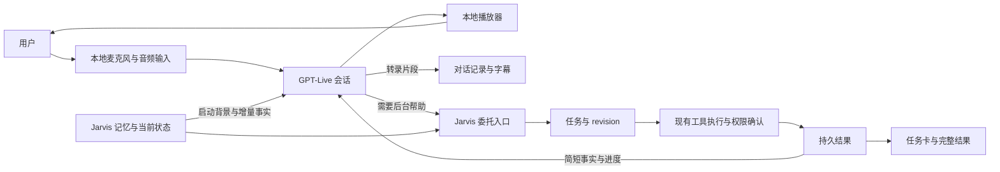

# Jarvis × GPT-Live 接入规划与探索记录

整理日期：2026-09-12\
代码审计基线：主工作目录 HEAD `68e60b9`\
状态：规划记录，包含已确认的用户取舍、官方文档核验、代码审计和建议方案。尚未完成 Live API 实测、实现或上线。

本文件汇总本次讨论，不代替正式 ADR 或产品验收规范。GOAL、spec、既有 ADR 和生产配置本轮均未修改。工作目录包含其他任务的未跟踪文件，审计未把其他 worktree 中的实现当作当前基线已具备的能力。

## 1. 目标与最新决策

总体目标：Jarvis 不再把语音能力绑定在自己维护的 ASR → 文本模型 → TTS 链上。GPT-Live 是第一个原生 Live 模型实现，现有链继续可用，后续供应商可以通过适配器接入。

用户最终希望：更换语音 Provider 后，记忆不丢、任务不中断、权限不改变、工具不重复执行、UI 状态一致，主要变化体现在语音模型和声音体验。

### 1.1 用户已经明确的取舍

本次讨论中，用户进一步明确：

> 当前架构有点重 后面我会优化 所以先不用管架构 直接播放就行 不然太重了

> 如有冲突可以不用全部按照之前的架构来 可以重新设计适配live的 然后优化

据此，后续设计遵循：

- GPT-Live 原生音频直接播放，不增加逐句后端审核。
- 不建立“普通内容走 Live、关键内容切回另一套 TTS”的双播报系统。
- 旧架构是可复用资产，不是不可改变的设计前提；与 Live 冲突的模块、分层或生命周期可以重新设计。
- 先验证自然对话和后台委托体验，再提炼统一 Provider 接口、优化结构。
- 简化语音路径不等于取消工具权限。真实操作仍由 Jarvis 管理权限、确认和执行证据。
- 保留的首先是产品行为保证，不要求保留原有每个类、事件、分层或调用路径。

### 1.2 已被后续讨论取代的建议

以下早期探索建议不再作为当前方案：

- 所有输出必须经过现有 L3 pre-emit gate 才能播放。
- 关键内容强制切回 Jarvis 专用受控播报通道。
- 先完成完整六层接口隔离，再开始 GPT-Live 真实接入。
- 普通 Live 对话必须逐轮创建并经过完整 ResponseRun。

新的方向是：Live 会话持续运行，Jarvis 后台在委托时介入。未来是否保留六层、是否重构 ResponseRun，依据实际闭环和复杂度决定；正式改变合同和架构检查前，要同步更新其记录，避免文档继续描述已经放弃的保证。

## 2. 推荐的整体方案

| 项目 | 当前建议 | 状态 |
| --- | --- | --- |
| 语音模型 | `gpt-live-1` | 用户指定，官方文档已核验 |
| 后端模式 | client delegation | 与 Jarvis 自有任务和工具匹配 |
| MVP 传输 | WebSocket | 根据当前 Python 音频所有权推荐 |
| 音频设备 | 继续由 Python daemon 持有 | 当前实现基础 |
| 输出方式 | Live 音频直接进入本地播放器 | 用户已明确 |
| 普通对话 | Live 自主完成，无须每句调用 Jarvis 后台 | 建议方案 |
| 后台任务 | 复用现有执行能力，按需调整入口 | 建议方案 |
| 记忆 | Jarvis 持久记录 + 简版 Session Brief | 用户目标，尚待实现 |
| UI | 对话字幕与任务真值分别展示 | 建议方案 |
| 默认切流 | 现有链先保留默认，Live 用配置开启 | 初始目标，未改变生产配置 |
| 未来 WebRTC | 客户端接管音频时再评估 | 延后，不是 MVP 前置条件 |

建议的逻辑关系如下；方框表示职责，不要求一一实现为服务或新模块。

### 2.1 职责分配

GPT-Live 负责听、说、自然停顿、插话、简短回应、基础对话，以及判断何时请求后台帮助。

Jarvis 负责长期记忆、动态信息查询、复杂任务、工具执行、权限确认、真实操作状态、结果持久化和 UI 的任务真值。

本地音频层负责设备、输入静音、播放静音、清空队列、实际停止播放和播放进度记录。Provider 不应另开一个不受控制的播放器。

### 2.2 避免重复工作

- 用户转录用于记录和理解，不自动等于“启动一个后台回答”。
- 普通聊天不同时调用旧文本模型生成第二份回答。
- 后台结果交给 Live 发声后，不能再由旧 TTS watcher 自动播一遍。
- 不把 Jarvis 的全部工具注册给 Live，不建立第二套 OpenAI 工具系统。
- 简短工具结果无需额外调用模型改写成口语；Live 可以负责自然表达。

## 3. 官方文档核验结果

以下是本轮已经获取并阅读的官方文档事实，不代表当前账号已获模型访问权限，也不代表本地 SDK 或设备已经通过实测。

### 3.1 产品与接入方式

GPT-Live 支持同时听与说，并允许后台任务在对话继续时运行。client delegation 可接应用自有模型、Agent 或服务。原生 Live 接口使用 `/v1/live/sessions`，不能把它写成原有 Realtime API 的换模型版本。

参考：[GPT-Live 入门](https://developers.openai.com/api/docs/guides/live)。

WebSocket 主连接承载双向音频和事件。输入应连续、按实际采样速度发送；输出由应用管理缓冲、重采样和播放。Live 不使用旧 Realtime 的 input-buffer commit / `response.create` 语音回合循环。输出音频没有可直接表示播放完成的 `audio_done` 事件。

参考：[WebSocket 指南](https://developers.openai.com/api/docs/guides/voice-websockets)。

### 3.2 委托语义

`session.delegation.created` 提供委托 ID 和时间偏移，不包含完整任务文本。应用从转录和自身状态构建请求，再决定执行及回传内容。结果通过对应委托 ID 关联；thinking 用于静默事实或进度，commentary 用于可说出的信息。

参考：[Delegation and tools](https://developers.openai.com/api/docs/guides/live-delegation)。

### 3.3 会话上下文与转录限制

启动 `input` 可包含相关背景；运行中追加上下文，每次 append 内容上限为 500 tokens。转录片段不构成权威完整回合，不能把显示分组当作操作触发依据。上下文 ACK 不证明模型已完整使用更新，更不证明播放或操作完成。commentary 可能被改述。存储和 fork 有条件，不应作为 Jarvis 永久记忆。

参考：[Managing GPT-Live sessions](https://developers.openai.com/api/docs/guides/live-conversations)。

### 3.4 控制与直接播放

输入 mute 不会停止模型输出或后台任务。停止本地播放需要控制媒体路径；instructions 是行为引导，其 ACK 不能保证声音已停止。若必须播放前审核，需要缓冲，代价是延迟。本次用户已选择直接播放，因此不承诺逐句预审。

参考：[Server-side controls](https://developers.openai.com/api/docs/guides/voice-server-controls?api=live)。

### 3.5 提示词与成本

Live instructions 应聚焦角色、语言、节奏、插话及委托条件；详细工具规则和业务流程留给后台。

参考：[Prompting GPT-Live](https://developers.openai.com/api/docs/guides/live-prompting)。

核验时模型页列出语音会话价格为每分钟 0.05 美元，按秒计费，后台模型及工具另计。该价格是文档快照，正式测试与部署前应重新核对。会话何时开启、何时闲置关闭，需要作为成本和使用体验的一部分设计。

参考：[GPT-Live 1 模型页](https://developers.openai.com/api/docs/models/gpt-live-1)。

### 3.6 探索中已纠正的假设

不能将旧 Realtime 的 `truncate`、provider item/content-part ID、权威 turn-final 或精确音频时间戳当作 Live 的通用保证。子 agent 最初提出过相关映射，已根据官方文档纠正。

不能等待一个不存在的“最终转录事件”才处理所有委托。应保存已有片段，结合时间窗口和当前任务构建请求；证据不足时保持待处理或澄清，不捏造完整回合。

同样不能声称发出停止指令后，远端上下文已按用户实际听到的位置截断。播放与模型内部对话的差异需要在接入测试中观察。

## 4. 代码审计：现有资产与缺口

探索由主任务与两个 GPT-5.6 Sol 子 agent 完成，分别检查音频路径和任务／状态路径。以下位置是当前基线的证据索引，不是未来必须保持的模块布局。

### 4.1 音频输入

| 发现 | 代码证据 |
| --- | --- |
| SenseVoice 接口输入为 16 kHz PCM16，返回识别结果 | [voice_asr.py](/Users/alllllenshi/Projects/jarvis/jarvis/surface/voice_asr.py:320) |
| VoicePipeline 本身不采集音频，处理完整音频的 ASR、规范化与 utterance 记录 | [voice_pipeline.py](/Users/alllllenshi/Projects/jarvis/jarvis/surface/voice_pipeline.py:57) |
| runtime 构建处直接选择 SenseVoice | [inherent_loop.py](/Users/alllllenshi/Projects/jarvis/jarvis/runtime/inherent_loop.py:2072) |
| 现有音频 backend 保留单输入所有权，当前实现并未另建第二输出流 | [voice_backend.py](/Users/alllllenshi/Projects/jarvis/jarvis/surface/voice_backend.py:1) |
| 当前会话包含 VAD、partial ASR 和 commit 路径 | [voice_session.py](/Users/alllllenshi/Projects/jarvis/jarvis/surface/voice_session.py:49) |

接入含义：Live 应复用物理输入，新增持续音频消费路径，不依赖当前 VAD 切成完整 WAV 后才提交。Live 开启时不能让 SenseVoice 同时把相同语音提交为第二个后台请求。

现有唤醒、PTT、设备切换和隐私控制仍有复用价值；是否保留某一套回合状态机，需要按 Live 实测重新决定。

### 4.2 音频输出与播放记录

| 发现 | 代码证据 |
| --- | --- |
| 已有 StreamingTTSProvider 输出侧接口 | [voice_media.py](/Users/alllllenshi/Projects/jarvis/jarvis/surface/voice_media.py:206) |
| TTSSession 是响应级 open/send/audio_events/finish/abort/close 契约 | [voice_tts.py](/Users/alllllenshi/Projects/jarvis/jarvis/surface/voice_tts.py:1836) |
| MiniMax TTS 在 runtime 构建，依赖在线凭据 | [inherent_loop.py](/Users/alllllenshi/Projects/jarvis/jarvis/runtime/inherent_loop.py:2090) |
| 流式输出由持久 media actor 管理 | [voice_media.py](/Users/alllllenshi/Projects/jarvis/jarvis/surface/voice_media.py:589) |
| 播放记录区分 accepted、submitted、estimated audible | [voice_ledger.py](/Users/alllllenshi/Projects/jarvis/jarvis/surface/voice_ledger.py:1) |
| heard_text 依赖已封闭且满足保守可听条件的完整文本片段 | [voice_ledger.py](/Users/alllllenshi/Projects/jarvis/jarvis/surface/voice_ledger.py:285) |
| 打断有本地 generation 与停止处理 | [voice_media.py](/Users/alllllenshi/Projects/jarvis/jarvis/surface/voice_media.py:2875) |

接入含义：不能把双向 Live 会话直接塞入单向 TTS 接口。可以复用播放器、队列和游标，但文本片段与音频一一对应的假设需要调整。

当前播放器的可听证据是保守估计，不等于物理麦克风回录，更不能证明用户注意到或理解了内容。

### 4.3 UI 与设备所有权

当前 Resonance 桌面客户端使用 WS/HTTP 控制面，不录音、不播放语音；daemon 持有音频。部分动画能量仍为模拟值。

证据：[Resonance HANDOFF](/Users/alllllenshi/Projects/jarvis/desktop/resonance/HANDOFF.md:3)。

本次审计没有在主 checkout 的 Swift 目录中找到可作为当前完整生产音频路径依据的 Swift 源码；其他 worktree 的 Swift/AEC 工作不能被当成此基线已经具备的实现。

因此首版没有必要先迁移客户端音频。未来改成 Swift 或其他客户端直接采集，再评估 WebRTC 和客户端播放回执。

### 4.4 后台任务、权限与幂等

| 已有能力 | 证据 |
| --- | --- |
| ResponseRun 生命周期和 terminal 管理 | [response_run.py](/Users/alllllenshi/Projects/jarvis/jarvis/decision/response_run.py:245) |
| 后台 ActionRunner 与执行资源管理 | [action_runner.py](/Users/alllllenshi/Projects/jarvis/jarvis/execution/action_runner.py:696) |
| SituationPacket 汇集任务、状态、确认和权限快照 | [packet.py](/Users/alllllenshi/Projects/jarvis/jarvis/decision/packet.py:50) |
| 同一输入提交的持久去重 | [input_submission_inbox.py](/Users/alllllenshi/Projects/jarvis/jarvis/state/input_submission_inbox.py:185) |
| 确认消费与操作准入的事务保护 | [authorized_dispatch_outbox.py](/Users/alllllenshi/Projects/jarvis/jarvis/state/authorized_dispatch_outbox.py:96) |
| 孤儿 ResponseRun 在重启时收敛为失败状态 | [response_run.py](/Users/alllllenshi/Projects/jarvis/jarvis/decision/response_run.py:877) |

这些是可以利用的资产。当前并没有通用 Live delegation receipt 和完整语义任务 revision 协议。UI 的事件 revision、确认 CAS revision，也不能直接等同于“用户改变任务要求”的 revision。

语音网络断线后后台继续运行，与 daemon 进程崩溃后任意任务都能自动续跑，是两个不同目标。现有恢复能力不能被描述为后者已经实现。

### 4.5 记忆与晨报

- Event Log 中已有对话投影，并区分展示内容和保守 heard 信息：[conversation.py](/Users/alllllenshi/Projects/jarvis/jarvis/state/conversation.py:43)。
- 另有 memory.db，包含追加记录、查询及背景注入：[memory_db.py](/Users/alllllenshi/Projects/jarvis/jarvis/state/memory_db.py:92)。
- 当前背景注入包含 profile 与最近若干天记录，并非带预算和来源的 Session Brief：[context_note](/Users/alllllenshi/Projects/jarvis/jarvis/state/memory_db.py:140)。
- memory.db 与 Event Log 是分离写入，不能假设二者天然处于同一事务快照。
- 本轮审计未找到完整晨报生成、调度、持久更新和验收链，不能称为已有功能。

Session Brief 应从持久记录和当前任务状态派生。长期记忆可提供背景，权限、操作状态和最新确认必须从当前任务系统读取。

### 4.6 “本地链”不等于完全离线

SenseVoice、VAD 和设备处理位于本地，MiniMax TTS 会将待朗读文本发送到在线服务。GPT-Live 还会在开启的会话中传输麦克风音频。

因此 `local_chain` 可作为原有链和故障备用，但不能未经改造就宣称为完全离线隐私模式。真正离线的模型与 TTS 组合可另行规划。

## 5. 适配 Live 的轻量设计

### 5.1 分离三个生命周期

| 生命周期 | 所有者 | 结束条件 |
| --- | --- | --- |
| 语音会话 | Live 连接管理 | 用户关闭、连接失败或会话策略 |
| 后台任务 | Jarvis 任务系统 | 完成、失败、明确取消或未决 |
| 音频播放 | 本地播放器 | 当前音频播完、用户停止、静音／设备策略 |

普通聊天无须绑定完整后台 ResponseRun。后台请求可以继续使用 ResponseRun，也可以在重新设计后采用更合适的任务入口；关键是避免把“一个 Live session”“一次工具执行”和“一段播放”视为同一对象。

### 5.2 最小 Provider 契约

以下是待验证的职责草案，不是已经冻结的 Python API：

| 能力 | 语义 |
| --- | --- |
| 开启会话 | 接收配置、语音 instructions 和启动背景 |
| 发送音频 | 接收持续有序音频帧，包含格式和本地流身份 |
| 接收音频与事件 | 异步返回音频片段、转录和控制结果 |
| 注入上下文 | 增量事实或静默进度 |
| 返回后台结果 | 可表达的事实与后台关联标识 |
| 更新说话行为 | 简短的应用侧指令 |
| 请求停止发声 | 声明所能提供的停止语义，不伪装远端硬取消 |
| 输入静音 | 与本地停止捕获／停止上传配合 |
| 关闭会话 | 释放连接并处理最后状态 |
| 能力声明 | 报告实际支持、条件限制及降级方式 |

本地“停止播放”必须有独立的播放器命令。Provider 不支持某种远端取消或恢复时，应明确返回不支持，不能用一个名字掩盖不同语义。

LocalChainedVoiceProvider 后续包装现有 ASR/TTS 路径，后台推理依然由 Jarvis 提供。它不是在 Provider 内复制整套工具和任务系统。

### 5.3 统一事件

首版可以表达：

- SessionStarted、SessionClosed、Error。
- UserTranscriptDelta、AssistantTranscriptDelta。
- BackendRequested。
- AudioReceived。
- PlaybackStarted、PlaybackStopped、PlaybackInterrupted。
- ContextAccepted／ContextRejected、UsageUpdated，按实际需要增加。

以上都是建议的 Jarvis 内部命名。播放器事件由本地生成；供应商会话事件经适配器转换。若提供 SpeakingStarted／SpeakingStopped，也必须注明其来自本地检测、启发式判断还是供应商报告，不能冒充精确语义回合边界。

高频音频留在媒体队列；需要恢复的委托、任务变化和结果保存在持久层。是否保存完整转录、保留多久，应单独配置。显示分组可以修正，不作为自动执行权限。

### 5.4 能力声明

至少覆盖：全双工、流式转录、上下文注入、外部 Agent 委托、打断、服务端控制、会话恢复、数据存储。

不建议只有含义模糊的布尔值。最少区分“支持／不支持／有条件”，并简述条件。例如：

- 模型全双工能力不等于当前扬声器设备已通过回声消除测试。
- 本地硬停播与远端停止生成是不同能力。
- 从 Session Brief 新开连接与供应商恢复原会话是不同能力。
- 支持供应商存储不等于默认启用存储。

声明根据实际适配器、传输、设备和配置填写。首版不为未知供应商预建完整框架。

## 6. Delegation bridge 与任务 revision

### 6.1 建议的最小处理流程

1. 收到委托元数据，按 `(provider_session_id, delegation_id)` 记录 receipt。
2. 收集委托时间附近的对话片段、当前任务、最新修正和 Session Brief。
3. 构建并持久化 Jarvis 后台请求；证据不足时等待相关片段或澄清。
4. 判断是新任务、当前任务的修改，还是只需补充信息。
5. 通过现有后台入口执行，操作权限继续由 Jarvis 检查。
6. 先保存结果，再检查 task revision 与当前会话，决定回传或等待下次连接。

片段到达可能延迟。不能只取“最后一句转录”，也不能仅按静音超时提交真实操作。明确的任务请求和明确的操作授权是不同事实。

### 6.2 最小关联信息

建议先保留：

- 本地会话身份及 provider session 身份。
- delegation ID 和 receipt 状态。
- task ID、revision。
- 来源对话片段／记录位置、所用背景版本。
- 结果记录身份、回传状态。

具体落在现有表还是小型新增表，实施时按实际事务边界决定。

### 6.3 去重与晚到结果

相同委托 ID 去重，只能处理同会话的重复事件。跨会话的新委托可能仍指向同一真实操作，需要复用任务和 Action 的操作身份，而不是重新派发。

用户把“周五、四个人”改为“周六、两个人”时，同一任务 revision 更新。旧查询结果可以留作记录，但不能覆盖新要求或作为当前答案播报。

如果旧 revision 已经完成了真实操作，不能只把结果丢弃：必须记录真实发生的操作，再决定是否需要更改、取消或补偿。对于执行与否不明的操作，先核对状态，不因超时或重连盲目重试。

若旧结果已经送入 Live 上下文，单纯拒绝后续回传无法撤回它。需要及时发送新事实，必要时停播并清空队列；不能保证只凭提示词彻底消除旧事实影响。这是实测项目。

## 7. 提示词、记忆与 Session Brief

### 7.1 Live instructions 的范围

建议只包含：Jarvis 的人格、主要语言、说话节奏、简短回应习惯、插话行为，以及委托条件。

应委托的情况包括：完整历史和原话、当前任务状态、动态信息、工具执行、复杂推理，以及改变后台任务的修正。

完整工具规则、具体业务流程和权限检查留在后台。不把用户文本拼接成高权限 instructions。

### 7.2 Session Brief 的建议内容

| 字段 | 用途 |
| --- | --- |
| schema_version / version | 区分结构和背景版本 |
| generated_at | 判断新旧 |
| profile | 稳定个人信息和沟通偏好 |
| current_focus | 当前关注事项 |
| recent_decisions | 最近确认的决定 |
| open_tasks | 未完成任务及当前状态 |
| today_context | 今日相关背景 |
| source_refs / source_cursor | 追溯来源和生成时的状态 |

先做小型有预算的背景生成器，不把全部历史塞进启动输入。hash、复杂缓存和增量投影可在确有需要时增加；不必为首版引入独立记忆服务。

### 7.3 更新流程

目标流程：用户事实、对话和工具结果先进入 Jarvis 持久记录，再更新结构化记忆／背景；当前会话只接收相关增量。

仅模型说出的内容不能自动成为已验证的个人事实或操作成功记录。记忆应保留来源与不确定性，最新明确修正覆盖旧背景。

静默上下文用于新事实和进度；commentary 用于适合说出的结果；instructions 只改变行为。不要把完整日志、Markdown、大型 JSON 或秘密推理塞入 Live。

“停止说话”期间，任务结果仍可入库和显示；何时恢复主动播报需要明确策略，不能因后台完成立即重新抢话。

### 7.4 晨报与精确查询

首版可接收已有晨报内容的摘要并更新背景，不把晨报调度系统列为首次 Live 闭环的前置条件。

用户要求完整晨报、原话、旧决定或历史来源时，由 Jarvis 查询原始记录。若以后新增每日晨报，另行定义时区、当日幂等、重启补偿和更新规则。

## 8. 打断、静音、播放与 heard ledger

### 8.1 独立控制

| 用户意图 | 应有行为 |
| --- | --- |
| “别说了” | 本地停止当前播放并清空待播内容，后台任务继续 |
| “停止生成这个回答” | 停止相应后台回答生成；远端 Live 控制按实际能力处理 |
| “取消刚才的预约” | 进入 Action 取消流程，核对成功后更新状态 |
| 麦克风静音 | 控制本地捕获／上传及 Provider 输入状态 |
| 播放静音 | 控制本地输出，不意味着输入或任务停止 |

### 8.2 本地可保证的打断动作

本地标记旧播放 generation 不再有效，停止播放器，清空队列，记录游标，然后向 Live 请求调整说话行为。恢复时不能把旧队列重新倒给用户。

不要为了每次轻微停顿就重建会话。仅在连接失败或实测证明上下文严重失配时考虑新会话恢复。

### 8.3 首版 heard ledger 的边界

继续区分：后台完成、模型生成、进入播放队列、提交设备、估计已播放。

Live 首版保留采样量、播放时长、generation、停止原因和证据质量。无法可靠对应的 transcript → audio 关系记为 unknown；不能根据网络接收顺序或转录时间估计“用户肯定听到了这句话”。

不把词级对齐做成首版前置工程。保守记录并不满足所有精确 heard-text 愿景，文档和验收应如实标明。

### 8.4 回声与设备测试

模型全双工不会自动解决设备回声。耳机、无 AEC 扬声器、有 AEC 扬声器应分别测试。复用现有安全 fallback；在某 profile 自然插话未验证前，不把它标为完整支持。

## 9. 断线、重连与 Provider 切换

建议首版采用应用恢复：连接失败后释放 Live 会话，后台继续处理并保存结果；下一次连接用新的 Session Brief 加相关近期对话恢复。

- 不以 provider session ID 作为长期任务身份。
- 重连不自动重播全部历史语音。
- 结果跨会话回传时重新关联当前会话，不能把旧 session 的委托 ID 当成新 session 的有效 ID。
- 切换 Provider 不重新执行未核对的 Action。
- 自动降级应由显式配置控制；首次切换可以先保持用户可见。
- 只有确认连接失效或新路径准备好后再切换，避免两个 Provider 同时占用音频或重复响应。
- daemon 崩溃恢复作为额外故障类型测试，不与普通网络重连混称。

MVP 建议不依赖供应商存储和 fork。供应商恢复可在以后作为优化加入，Jarvis 自己的持久状态仍为基础。

## 10. 需要修订的项目文档

本轮已定位的冲突：

| 文档 | 当前冲突 | 后续处理 |
| --- | --- | --- |
| [GOAL.md](/Users/alllllenshi/Projects/jarvis/GOAL.md:5) | 明确不接 OpenAI Realtime，完成条件绑定旧 ASR→L3→TTS 路径 | 改为 Live 接入与行为验收目标 |
| [ADR-0006](/Users/alllllenshi/Projects/jarvis/docs/adr/0006-full-duplex-voice-session.md:9) | 排除托管 speech-to-speech runtime | 新 ADR 明确替代对应 non-goal |
| [ADR-0008](/Users/alllllenshi/Projects/jarvis/docs/adr/0008-real-time-response-streaming.md:9) | 自有输出 gate／回合流与托管语音排除项 | 明确普通 Live 对话与后台任务的边界 |
| [ADR-0014](/Users/alllllenshi/Projects/jarvis/docs/adr/0014-inherent-realtime-ux.md:72) | 排除托管语音会话 | 保留可用 UI 行为，替代冲突部分 |
| [spec §3.6.5–6](/Users/alllllenshi/Projects/jarvis/docs/spec.html:1065) | 所有 TTS 必须经过 pre-emit／ResponsePlan | 明确 Live 原生音频直接播放 |
| [CLAUDE.md](/Users/alllllenshi/Projects/jarvis/CLAUDE.md:19) 与 [.importlinter](/Users/alllllenshi/Projects/jarvis/.importlinter) | 现有六层与跨层装配规则 | 只有确定改变结构时同步修订，避免实现与规则冲突 |

修订理由是引入原生 Live 模型，不是声称 GPT-Live 与旧 Realtime API 是同一产品。

新 ADR 建议题名为 **Live Voice Provider and Conversation Ownership**，编号实施时核对现有占用，状态按真实审批／实施进度填写。主要记录：引入动机、直接播放决定、供应商和 Jarvis 的职责、会话与任务分离、MVP 传输、恢复和切流原则。

不需要把逐文件实施清单写进 ADR。旧 ADR 保留历史，新增 supersedes/amends 标注，不悄悄改写过去决策。

## 11. 分阶段实施与验收

以下是建议路线，尚未实施；可依据真实 Live 表现调整。

### 阶段 A：最薄的原生语音闭环

配置开启 GPT-Live，Python WebSocket 连续发送音频，本地播放返回音频，展示转录，支持停止播放、输入／输出静音及关闭。

此阶段先用合成背景和受控测试会话，不接真实副作用工具。重点证明自然对话、连续追问、停顿和插话，而不是完成通用 Provider 框架。

验收：只有一个设备 owner；没有旧链双重回答／双重播放；控制确实作用于本地声音；耳机和扬声器表现分别记录。

### 阶段 B：Jarvis 委托闭环

接入现有后台只读能力，增加简版 Session Brief、委托 receipt、请求构建和结果回传。后台运行期间继续对话，UI 保留完整结果。

验收：查资料时可追问和补充要求；委托事件重送不重复起任务；转录片段不会每段触发回答；后台失败能准确反馈。

### 阶段 C：任务一致性与恢复

补齐语义 revision、旧结果抑制、断线后的结果保存和新会话恢复。接入原有权限确认，逐步开放会产生副作用的操作。

验收：用户改要求后，旧结果不作为当前答案输出；旧操作已经发生时记录事实；拒绝权限不执行；网络重连不重复动作；不明确执行结果不盲重试。

### 阶段 D：统一 Provider、比较和切流

根据两条已验证的链提炼必要接口，包装 LocalChainedVoiceProvider，增加能力声明、配置和明确的故障降级。用相同场景比较，稳定后再决定默认切流。

保留原链不等于永远保留所有旧内部结构。后续供应商主要实现传输、事件转换、上下文和结果回传；公共 delegation bridge、任务与 UI 语义应复用。

## 12. 测试矩阵与指标

| 场景 | 必须观察的行为 |
| --- | --- |
| 普通问答 | Live 自然回答，无额外后台回合 |
| 连续追问 | 上下文连贯，不重复解释 |
| 插话／自然停顿 | 不抢话、不把回声当用户，设备 profile 有记录 |
| “别说了” | 本地停播，后台继续，旧队列不恢复 |
| 取消回答 | 与取消真实操作不同 |
| 取消操作 | 实际取消结果与 UI／语音一致 |
| 修改任务 | 同任务 revision 更新，旧结果不覆盖新要求 |
| 记忆增量 | 新事实有持久来源，再进入会话背景 |
| 晨报更新 | 已有内容更新可注入；完整生成能力另验收 |
| 精确历史查询 | 后台返回原文／来源，不让摘要代替证据 |
| 工具失败 | 不把失败播报为成功 |
| 权限拒绝 | 工具不执行，任务状态正确 |
| 断线重连 | 后台继续，新会话恢复相关上下文 |
| daemon 重启 | 复用恢复机制，明确无法自动续跑的部分 |
| 旧结果晚到 | 按 revision 判断，不覆盖；真实副作用照实记录 |
| 重复委托／跨会话重述 | 不重复执行同一真实操作 |
| Provider 切换 | 设备、任务、确认、UI 身份保持一致 |
| 静音与后台完成竞态 | 静音不误取消任务，结果不擅自抢话 |

比较指标：自然度、有效回答首音延迟、停止播放延迟、任务委托延迟、语义识别准确率、任务成功率、重复操作数、旧结果误播数、会话恢复成功率和成本。

记录 p50/p95、设备、网络、冷／热启动及失败样本。简单“嗯”“我看看”不能算首个有意义的答案；模型全双工支持不能代替设备端验收。

双轨验证是使用同一批场景比较。涉及副作用时不能让两个 Provider 各执行一次同样操作；使用隔离夹具或只比较其中一个获准执行的路径。

## 13. 原始 25 项目标的处置映射

| 原步骤 | 当前处理 |
| --- | --- |
| 1 架构原则 | 保留供应商／Jarvis 职责；允许重新设计旧分层 |
| 2 修订项目决策 | 保留，新增 ADR 并明确覆盖旧约束 |
| 3 LiveVoiceProvider 接口 | 保留目标，真实闭环后提炼最小接口 |
| 4 统一事件 | 保留；区分供应商事件、本地播放事实和持久任务事件 |
| 5 能力声明 | 保留；支持程度和条件明确，不伪装全功能 |
| 6 LocalChainedVoiceProvider | 保留，后移到统一阶段，现有链先继续可用 |
| 7 OpenAIGPTLiveProvider | 保留 `gpt-live-1` 与 client delegation |
| 8 连接方式 | 首版 WebSocket，客户端音频迁移后再评估 WebRTC |
| 9 提示词拆分 | 保留，语音人格与后台流程分离 |
| 10 Session Brief | 保留，先小型版本化背景 |
| 11 记忆更新 | 保留持久化优先，不先重建整个记忆系统 |
| 12 会话内更新 | 保留 facts／commentary／instructions 的不同用途 |
| 13 按需查询 | 保留，全文和动态事实由后台查询 |
| 14 delegation bridge | 保留；普通聊天不强制 ResponseRun，委托才进入任务 |
| 15 task revision | 保留，区别于现有 UI 事件 revision |
| 16 输出映射 | 简短事实给 Live，完整结果给 UI；原生音频直接播放 |
| 17 三种取消 | 保留，远端能力不足时明确说明 |
| 18 heard ledger | 保留播放事实；首版不承诺精确 heard words |
| 19 权限控制 | 保留真实操作检查与确认，不从模型话语推断成功 |
| 20 故障恢复 | 保留应用侧恢复，不依赖供应商永久记忆 |
| 21 配置与降级 | 保留，自动切换不能重放操作 |
| 22 测试场景 | 全部保留，新增重复事件、静音和跨会话竞态 |
| 23 双轨验证 | 保留，同场景比较，不双执行副作用 |
| 24 逐步切流 | 保留，先只读后操作，默认切换需真实证据 |
| 25 新供应商模板 | 保留最终方向，避免提前构建庞大兼容框架 |

## 14. 待验证与待细化事项

实施前或相应阶段必须获得实际证据：

- 当前账号能否访问 `gpt-live-1`，本地 SDK 是否具备对应接口。
- 中文、中英混说、专有名词、姓名和用户实际说话方式的表现。
- 现有音频设备的采样、缓冲、回声、自然插话和停止延迟。
- 委托事件与转录到达顺序，如何处理晚到片段和模糊修正。
- 停播后模型如何继续对话，是否需要额外事实更新或偶发重建会话。
- 旧 commentary 已注入后收到修正时，如何降低旧结果误播。
- 会话激活、闲置退出、后台结果等待下一会话的策略。
- 转录保留范围、背景传输范围及真正离线模式的后续要求。
- 哪些 ResponseRun、UI 协议和模块值得保留，哪些重构后更简单。

这些是后续实现与测试内容，不表示现在需要重新征求已经获得的“直接播放”和“允许重新设计”授权。

## 15. 下一个具体交付

建议先形成精简 ADR 和最薄 Live 原型，围绕以下体验验收：

> 唤醒 Jarvis → 自然聊几句 → 请求查询 → 查询期间继续说话并修改条件 → 听到最新结果 → 说“别说了”立即停播 → 重新连接后仍知道任务状态。

先证明这条用户体验，再扩展恢复、Provider 模板和默认切流。最终以实际对话、工具记录、播放记录和恢复结果验收，而不是以新增接口数量或测试套件全绿代替完成。

当前已完成：讨论与决策整理、官方资料核验、两条代码路径审计，以及本规划文档。当前未完成：正式合同修订、Live 接入代码、真实模型与设备测试、生产切流。
